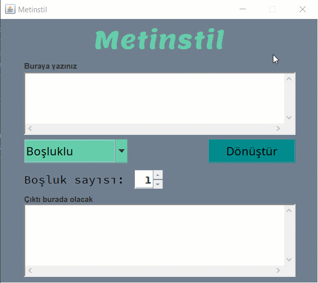

# metinstil

Selamlar, Java öğrenme serüvenimde eğlence amaçlı bir uygulama yaptım ve bunu burada paylaşmak istedim.

Uygulama kısaca girdiğiniz metni seçtiğiniz kurala uygun olarak çıktıya çavirir ve size verir.

:arrow_down: [Uygulama gifi](metinstil.gif) (2mb) :arrow_down:

----

_Not:_ Bu uygulamayı Java Swing ile yaptım ve bolca String metodu kullandım :grin:
